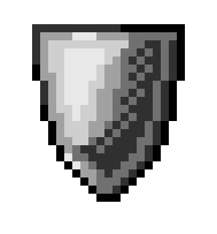
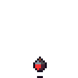
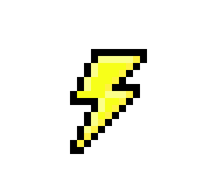

 # Dungeon Master: The Legend of j'0hn

Help j'0hn, hero of the Land of Placeholder, escape the dungeon he's been trapped in by
the dark lord Garblax, the slime master. Be prepared to hack and slash through hordes of
enemies on your way to freedom from the depths of Dunegon, the third largest dungeon in 
all of Placeholder. Along the way meet a number of characters and enemies, starting with:

### j'0hn, The Hero

Control j'0hn, our hero by using the arrow keys to traverse the various rooms. Use the 
space bar to make j'0hn swing his sword to tear through enemies on your way to escape,
but don't let his health get too low. If you do, our hero will be defeated and the land
will fall into darkness. Keep your eye out for hidden rooms, containing boosts to health,
defense, and speed.

### Silme

The first of Gaarblax's evil minions, the silmes (sill-mees) will follow j'0hn throughout the room,
even climbing up walls to get to you. Don't worry too much though, one swing will take out
these green menaces. However, when in a horde these monsters can prove to be a formidable
foe. 

### Sliem

Unlike the silmes, these enemies won't try to follow you. Instead, they'll bounce back
and forth waiting for you to run into them. Once again weak, these enemies will also die
in one hit, but be careful, they're fast and can slowly leech away at your health if you
run into their path.

### Hydra

Beware of the hydra, a special variety of slime which splits into two small silmes when
killed. Perhaps the most dangerous of Gorblax's minions, these slimes have claimed many
adventurers over time.

## Powerups

   

Keep your eye out for these hidden powerups. These powerups come in three types: The shield
of durability, the lightning bolt of speed, and the health potion (of health). Search for 
secret rooms containing these elusive powerups in order to make j'0hn stronger and more capable
when fighting Garblox's army of slimes.

Note: In order to avoid giving him power, Grablax's name has been misspelled in each time he is 
mentioned.

Image Sources:
http://fishssticks.tumblr.com/post/160558029798/friend-i-think-hyperfixationspecial-interest - speed powerup
